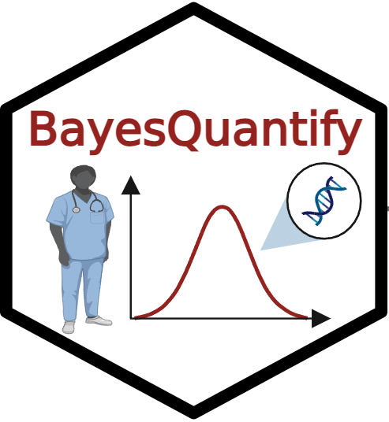

<!-- README.md is generated from README.Rmd. Please edit that file -->

# BayesQuantify 

<!-- badges: start -->

[](https://github.com/liusihan/BayesQuantify/actions/workflows/R-CMD-check.yaml)
[](https://app.codecov.io/gh/liusihan/BayesQuantify?branch=master)
<!-- badges: end -->

## Overview
The ACMG/AMP guidelines have undergone continuous review and refinement
for different rules, genes, and diseases, driving optimization and
enhancing variant interpretation standards in genetic testing. In 2018,
the ClinGen Sequence Variant Interpretation Working Group has proposed a
Bayesian Classification Framework to model the ACMG/AMP guidelines. This
framework has successfully quantified the thresholds for applying PM5
and PP3/BP4. However, existing software and tools designed for quantifying 
the evidence strength and establishing corresponding thresholds to refine 
the ACMG/AMP criteria are lacking.

The `BayesQuantify` R Package provide users with a unified resource 
for quantifying the strength of evidence for ACMG/AMP criteria using a 
naive Bayes classifier. The functions included in BayesQuantify consists 
of six main steps (as shown in Figure 1):


<p align="center"> Figure 1. Schematic overview of BayesQuantify. </p>

## Installation

You can install `BayesQuantify` from GitHub:

``` r
library(devtools)
devtools::install_github("liusihan/BayesQuantify")
```

## Required Input Data
The package requires one essential input: a data.frame containing variants classification results, including the variants, ACMG/AMP evidence, variant classification, and tested features.

Two distinct datasets: the ClinGen Curated Variants dataset and the ClinVar 2019 dataset have been included in `BayesQuantify`. Here is an example input file：

|#Variation|Assertion|Applied Evidence Codes (Met)|HGNC Gene Symbol|Expert Panel|...|
|---|---|---|---|---|---|
|NM_000277.2:c.1A>G|Pathogenic|PS3, PM3, PP4_Moderate, PM2|PAH|Phenylketonuria VCEP|...|
|NM_000314.6:c.209+3A>T|Uncertain Significance|PP3|PTEN|PTEN VCEP|...|
|NM_004999.3:c.2836C>T|Likely Benign|BS1|MYO6|Hearing Loss VCEP|...|
|...|...|...|...|...|...|


## Usage
The full usage of BayesQuantify can be found [here](https://github.com/liusihan/BayesQuantify/blob/207dfa884c0ac84b8ed281ece95dee5e1b3a8fb6/man/figures/BayesQuantify.pdf).
``` r
> library(BayesQuantify)

##step 1: Determining theoretical OP
> auto_select_postp(0.1)
  Evidence Strength Odds of pathogenicity Posterior probability of pathogenicity and benignity
1               PVS                   351                                                0.975
2                PS      18.7349939951952                                     0.67550020016016
3                PM      4.32839392791312                                    0.324749849931156
4                PP      2.08047925438182                                    0.187760764369383
5                BP     0.480658481882885                                    0.949301150041276
6                BM     0.231032576205959                                    0.974972184931784
7                BS    0.0533760512683624                                    0.994104293142569
8               BVS   0.00284900284900285                                    0.999683544303797

##step 2: Variants of US (VUS) subclassification
> data("ClinGen_dataset")
> data <- add_info(ClinGen_dataset, "Assertion")
> data <- VUS_classify(data, "Assertion", "Applied Evidence Codes (Met)")
> all_evidence <- unlist(str_replace_all(data$`Applied Evidence Codes (Met)`," ", ""))
> split_evidence <- strsplit(all_evidence, ",")
> unique_evidence <- unique(unlist(split_evidence))
> P_evidence<-grep("^P", unique_evidence, value = TRUE)
> library(dplyr)
> truth_set <- filter(data,VUS_class %in% c("IceCold","Cold","Cool",""))
> for(i in P_evidence){
   truth_set <- discrete_cutoff(truth_set, "Applied Evidence Codes (Met)", criteria = i)
 }

##step3: Calculating LR or lr
> LR_result<-LR(truth_set, 28, 72)
> rownames(LR_result)<-LR_result[,1]
> LR_result<-LR_result[,-1]
> name_evidence<-rownames(LR_result)
> LR_result<-data.frame(lapply(LR_result,as.numeric))
> rownames(LR_result)<-name_evidence

##step 4: Visualization
> multi_plot(ClinGen_dataset, "Assertion", "HGNC Gene Symbol")
> op_list <- c(2.08, 4.33, 18.70, 350)
> heatmap_LR(LR_result, op_list)
```

## Citation
If you use BayesQuantify, please cite our paper (thanks!):
> Liu S, Feng X, Bu F. BayesQuantify: an R package utilized to refine the ACMG/AMP criteria according to the Bayesian framework[J]. medRxiv, 2024: 2024.09. 08.24313284.


## Getting help
If you encounter a clear bug, please file an issue with a minimal reproducible example on GitHub. For questions and other discussion, please contact Sihan Liu (liusihan@wchscu.cn).
